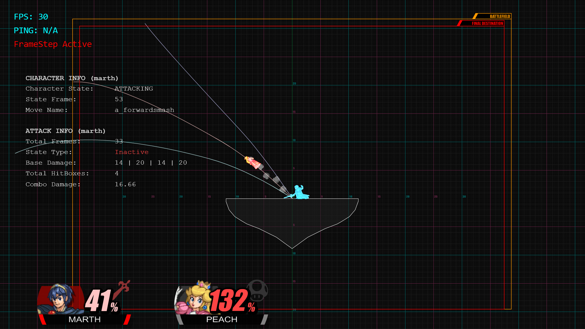
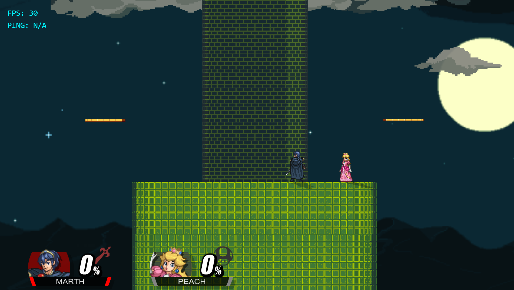
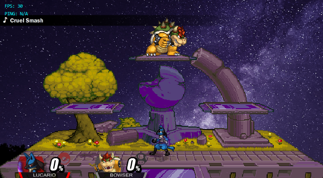

# SSF2 1.4 Training MOD [Beta]

Enhance your training experience in Super Smash Flash 2 v1.4 with advanced labbing tools, hitboxes, frame data, and custom stage aesthetics.

---

## Table of Contents
- [About The Project](#about-the-project)
- [Features](#features)
- [Aesthetic Changes](#aesthetic-changes)
- [Installation](#installation)
- [Known Bugs](#known-bugs)
- [Frequently Asked Questions](#frequently-asked-questions)
- [Credits](#credits)

---

## About The Project

**SSF2 1.4 Training MOD** expands upon the built-in training mode with advanced utilities. Building upon **SSF2 CE (Community Edition)**, this mod ports labbing functionality and introduces new enhancements to help players optimize their tech, setups, and frame precision.

---

## Features

- **Hitbox & Hurtbox Visualization:** Toggle real-time hitboxes and hurtbox displays.
- **Hitstun Indicators:** Visual color cues for hitstun state tracking.
- **DI Lines:** Display directional influence trajectories on hit.
- **Frame Data Overlay:** On-screen readout of frame startup, active frames, and recovery.
- **Expanded CPU Behavior:** Extended options for CPU dummy behavior and teching options.
- ...and much more.

---

## Aesthetic Changes

### Music & Audio
- Custom Training Mode menu track.
- Alternate stage music when Stage Alts are enabled.

### Stage Variants (20XX Style)
* **Tower of Salvation**
  * Alternate skin: *Tower of Heaven* (Rivals of Aether theme)
  * Custom dynamic music track when active.

  

* **Battlefield**
  * Alternate skin: *Night Battlefield*
  * Custom dynamic music track when active.

  

---

## Installation

1. Go to the [Latest Release Page](https://github.com/pecefulpro/1.4-Training-Mod/releases/latest).
2. Download the `.zip` archive.
3. Extract the contents directly into your main **Super Smash Flash 2** installation directory, overwriting existing files when prompted.
4. Launch the game and enter **Training Mode**.

---

## Known Bugs

> [!WARNING]
> This mod is currently in **Beta**. Please report any unlisted issues.

- **Replay Desyncs:** Saving or replaying matches recorded while training mod scripts are active may cause playback desyncs.
- **Menu State Memory:** Quitting and re-opening training menus may occasionally cause options to reset or default to incorrect values.

---

## Frequently Asked Questions

<b>1. Will there be future updates to this mod?</b>

 
Yes, ongoing updates are planned based on community feedback and bug reports.

<b>2. Will this mod be updated to future versions of SSF2?</b>

 
Porting to future SSF2 builds depends on available development time and the extent of changes in base game updates.

<b>3. How do I report a bug?</b>

 
First, check the <a href="#known-bugs">Known Bugs</a> section. If your issue isn't listed:
<ul>
  <li>Open a new issue on the <a href="https://github.com/pecefulpro/1.4-Training-Mod/issues">GitHub Issues</a> page.</li>
  <li>Directly contact or tag <b>Me</b> on Discord.</li>
</ul>

<b>4. Is there Linux or macOS support?</b>

 
Currently, the mod only natively supports <b>Windows</b>. Linux/macOS releases may be evaluated if there is sufficient community demand.

---

## Credits

Special thanks to everyone who contributed to the planning, visuals, and development of this mod:

* **Monte** – Project Lead, Programming/Development, UI Design, Core Ideas
* **David** – IDK Creator
* **Rosie** – Feature Concepts & Design Ideas
* **VAL** – Palette Creator
* **Brayxen075** – Stage Alts
* **Wex** – SSF2 Color Vault 